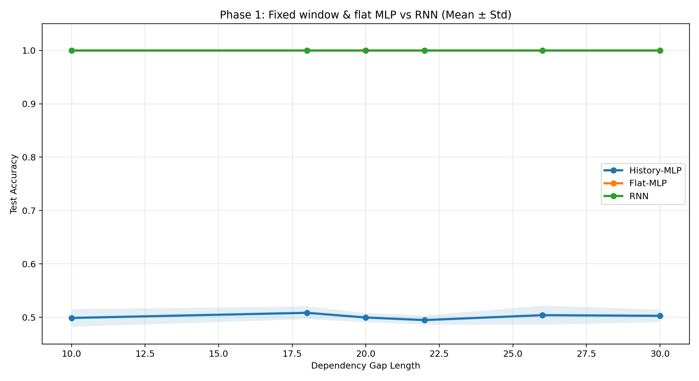
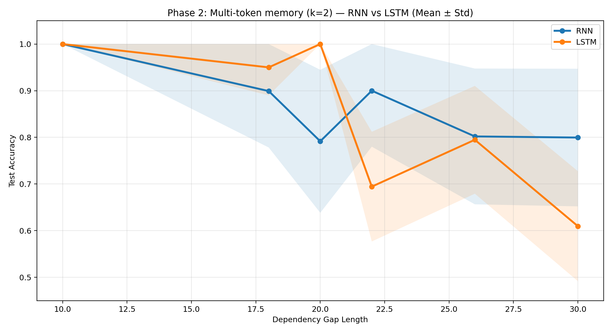
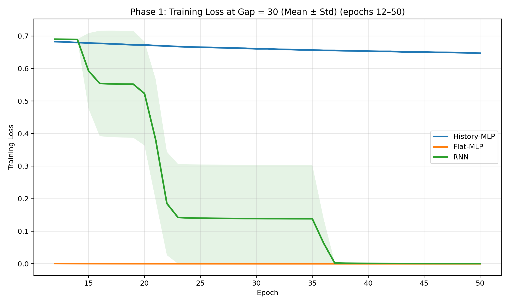
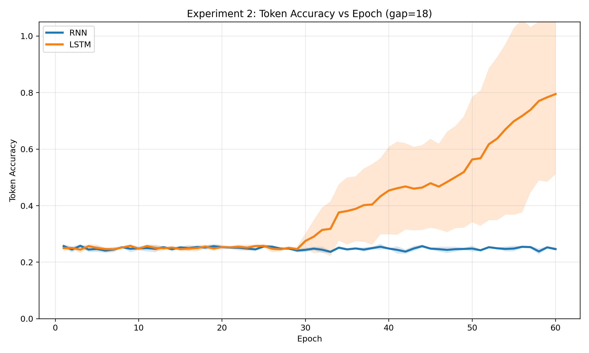

# Delayed Memory Experiments for RNN

<p align="center"><sub>Reproducible PyTorch benchmarks for teaching <b>why recurrence</b> and <b>why LSTM</b> — built for slides, not papers.</sub></p>

> **Short dependencies beat long ones. Recurrence shares weights across time. LSTM gates what to remember.** This repo runs two controlled narratives on synthetic delayed-memory tasks: Phase 1 pits fixed-window and flat MLP baselines against an RNN; Phase 2 pits plain RNN against LSTM when the gap gets long. One command → band plots, heatmaps, JSON metrics, and copy-task learning curves you can drop straight into a deck.

<p align="center">
  <a href="requirements.txt"></a>
  <a href="requirements.txt"></a>
  <a href="#quickstart"></a>
  <a href="#outputs"></a>
  <a href="说明文档.md"></a>
</p>

<p align="center"><b>English</b> · <a href="说明文档.md">简体中文</a> · <a href="循环神经网络_汇报报告.docx">汇报 Word</a></p>

---

## Showcase

The figures below ship in-repo under `outputs/` and `outputs_exp2_copy_task_final/` — regenerate anytime with the commands in [Quickstart](#quickstart).

<table>
<tr>
<td width="50%" valign="top">
<a href="outputs/phase1_accuracy_vs_gap_bands.png"></a><br/>
<sub><b>Phase 1 · Why recurrence</b><br/>History-MLP (fixed window) · Flat-MLP (full sequence, no weight sharing) · RNN. As gap grows, the window baseline often cannot see the label-relevant token; the flat MLP sees the same symbols but without temporal structure.</sub>
</td>
<td width="50%" valign="top">
<a href="outputs/phase2_accuracy_vs_gap_bands.png"></a><br/>
<sub><b>Phase 2 · Why LSTM</b><br/>RNN vs LSTM on multi-token delayed memory. At long gaps, plain RNN accuracy collapses while LSTM stays stable — the slide story for gated memory.</sub>
</td>
</tr>
<tr>
<td width="50%" valign="top">
<a href="outputs/phase1_training_loss_gap_max.png"></a><br/>
<sub><b>Training loss (Phase 1)</b> · max gap slice — how fast each architecture fits once the dependency length is fixed.</sub>
</td>
<td width="50%" valign="top">
<a href="outputs_exp2_copy_task_final/exp2_copy_token_learning_curve.png"></a><br/>
<sub><b>Experiment 2 · Copy task</b> · dedicated <code>experiment_lstm_copy_task.py</code> run — token recall learning curves where RNN stays near chance and LSTM climbs.</sub>
</td>
</tr>
</table>

---

## Why this exists

Recurrent networks are easy to *describe* and hard to *show*. A single accuracy number on MNIST does not explain:

| Without a controlled task | What you miss |
|---|---|
| “RNNs handle sequences” | *Which* part of the sequence matters, and *when* |
| “LSTM fixes vanishing gradients” | A visible gap where plain RNN fails and LSTM does not |
| “Just use a bigger MLP” | Same tokens, different inductive bias — weight sharing vs flattening |

**This project is the controlled task.** Synthetic sequences, sweepable gap length, multiple seeds, phase-split plots — so a 15-minute talk can show *mechanism*, not folklore.

We stand on a simple stack:

- **PyTorch** — `nn.RNN` / `nn.LSTM` classifiers plus two non-recurrent baselines in one file ([`experiment.py`](experiment.py)).
- **Optional JSONL export** — freeze datasets for reproducible demos (`--export-data` / `--data-dir`).
- **Copy-memory follow-up** — a cleaner RNN vs LSTM story in [`experiment_lstm_copy_task.py`](experiment_lstm_copy_task.py).

---

## At a glance

| | What you get |
|---|---|
| **Two narrative phases** | Phase 1: History-MLP · Flat-MLP · RNN. Phase 2: RNN · LSTM. |
| **Four model families** | Fixed window · flat sequence MLP · vanilla RNN · LSTM — same vocab, same task, different structure. |
| **Gap sweep** | Dependency length from 5 to 100 (presets: `slides`, `quick`, or custom `--gaps`). |
| **Multi-seed stability** | Default 5 seeds; mean ± scaled std bands on every curve. |
| **Extra metrics** | Critical gap · time-to-loss-threshold · matched-parameter table (`--match-lstm-params`). |
| **Slide-ready artifacts** | `phase1_*` / `phase2_*` PNGs + `metrics.json` + human-readable `summary.txt`. |
| **Copy task (Exp 2)** | Token / sequence accuracy + learning curves under `outputs_exp2_copy_task_final/`. |
| **Report (Word)** | Full narrative → [`循环神经网络_汇报报告.docx`](循环神经网络_汇报报告.docx). |
| **中文说明** | Full walkthrough → [`说明文档.md`](说明文档.md). |

---

## Task

Each sequence looks like this (Phase 2 uses a `k`-token prefix; default `k=2` → 4 pattern classes):

```text
A B c d e f g ... ?
A A c d e f g ... ?
B A c d e f g ... ?
```

- The **first `k` tokens** encode the class (pattern).
- The **middle** is random distractors from `{c,d,e,f,g}`.
- The final **`?`** asks the model to predict the pattern class.

Larger **gap** → longer distractor run → harder long-range credit assignment. That is the knob your slides turn.

---

## Compared models

| Model | Role in the story |
|---|---|
| **History-MLP** (`FixedWindowMLP`) | Only the last `history_window` tokens (default 5) — fixed-window “old baseline”. |
| **Flat-MLP** (`FlatSequenceMLP`) | Full sequence one-hot flattened → MLP. Same symbols as RNN, **no** weight sharing; input dim grows with length. |
| **RNN** (`RNNClassifier`) | Reads the whole sequence; hidden state propagates forward. |
| **LSTM** (`LSTMClassifier`) | Gated memory — Phase 2 hero when gaps are long. |

---

## Quickstart

```bash
git clone git@github.com:AndrewAccuracy/RNNtest.git
cd RNNtest
python -m venv .venv
source .venv/bin/activate   # Windows: .venv\Scripts\activate
pip install -r requirements.txt
```

**Default two-phase run** (writes `outputs/`):

```bash
python experiment.py
```

**Recommended for slides** (full gap sweep + 5 seeds):

```bash
python experiment.py --preset slides
```

**Quick smoke test**:

```bash
python experiment.py --preset quick --epochs 2
```

**Custom sweep**:

```bash
python experiment.py \
  --epochs 20 \
  --hidden-size 16 \
  --gaps 5 10 18 20 22 26 30 50 100 \
  --seeds 1 2 3 4 5 \
  --phase2-prefix-len 2 \
  --match-lstm-params
```

> If you only use small gaps (e.g. 5 and 10), RNN and LSTM often both hit ~100% — expected overlap, not a bug. Use `--preset slides` or gaps ≥ 18 to separate Phase 2.

### Experiment 2 — copy task (RNN vs LSTM)

Cleaner “why LSTM” demo with token-level metrics:

```bash
python experiment_lstm_copy_task.py \
  --gaps 15 18 \
  --seeds 1 2 3 \
  --memory-length 3 \
  --train-samples 1800 \
  --test-samples 400 \
  --batch-size 64 \
  --epochs 60 \
  --embedding-dim 32 \
  --hidden-size 128 \
  --num-symbols 4 \
  --token-threshold 0.75 \
  --output-dir outputs_exp2_copy_task_final
```

### Optional: export / load fixed data

Export JSONL splits (same RNG rules as in-code generation):

```bash
python experiment.py --export-data
```

Train from disk (all seeds share the same files — variance is init/order, not resampling):

```bash
python experiment.py --data-dir data/delayed_memory
```

---

## Six load-bearing ideas

### 1 · Two phases, one repo.

Phase 1 answers “why not just an MLP?” Phase 2 answers “why not just an RNN?” Split figures (`phase1_*`, `phase2_*`) map 1:1 to slide sections.

### 2 · Gap is the independent variable.

Everything else can stay fixed while **gap length** moves on the x-axis. That is how you *show* long-term dependency without hand-waving.

### 3 · Seeds are first-class.

Default five seeds → mean curves + variability bands. One lucky run is not a result.

### 4 · Baselines are fair but different.

Flat-MLP sees the same token set as RNN; History-MLP does not. The comparison teaches **inductive bias**, not cheating.

### 5 · Metrics beyond accuracy.

`critical gap`, training time to loss threshold, and optional matched-parameter tables support Q&A after the talk.

### 6 · Artifacts are the product.

The goal is not SOTA — it is **PNG + JSON + summary.txt** you can paste into Keynote/PowerPoint without a second plotting pass.

---

## Architecture

```
┌──────────────────── experiment.py ────────────────────┐
│  For each gap × seed:                                  │
│    generate (memory or --data-dir JSONL)               │
│    train History-MLP · Flat-MLP · RNN · LSTM           │
│    log accuracy · loss · timing metrics                │
└────────────────────────┬──────────────────────────────┘
                         ▼
              aggregate multi-seed stats
                         │
         ┌───────────────┴───────────────┐
         ▼                               ▼
   phase1 figures                  phase2 figures
   (3 models)                      (RNN vs LSTM)
         │                               │
         └───────────────┬───────────────┘
                         ▼
                  outputs/*.png
                  outputs/*.json
                  outputs/*_summary.txt

┌──────── experiment_lstm_copy_task.py ───────────────┐
│  Delayed copy · token + sequence accuracy              │
│  → outputs_exp2_copy_task_final/                       │
└────────────────────────────────────────────────────────┘
```

| Layer | Stack |
|---|---|
| Runtime | Python 3.10+ · PyTorch 2.2+ |
| Plotting | matplotlib (Agg backend) |
| Data | In-memory RNG · optional JSONL under `data/delayed_memory/` |
| Entrypoints | [`experiment.py`](experiment.py) · [`experiment_lstm_copy_task.py`](experiment_lstm_copy_task.py) |

---

## Outputs

All paths relative to repo root.

### Phase-focused (recommended for slides)

| File | Use on slide |
|---|---|
| `outputs/phase1_accuracy_vs_gap_bands.png` | Phase 1 headline chart |
| `outputs/phase1_accuracy_heatmap.png` | Optional detail grid |
| `outputs/phase1_training_loss_gap_max.png` | Optimization speed story |
| `outputs/phase2_accuracy_vs_gap_bands.png` | Phase 2 headline chart |
| `outputs/phase2_seed_accuracy_scatter.png` | Seed stability |
| `outputs/phase2_training_loss_gap_max.png` | RNN vs LSTM loss |
| `outputs/phase2_time_to_threshold.png` | Epochs-to-threshold |

### Metrics & text

- `outputs/phase1_metrics.json`, `outputs/phase2_metrics.json`, `outputs/metrics.json`, `outputs/metrics_combined.json`
- `outputs/phase1_summary.txt`, `outputs/phase2_summary.txt`, `outputs/summary.txt`
- `outputs/matched_parameter_table.md` (with `--match-lstm-params`)

### Experiment 2 copy task

Under `outputs_exp2_copy_task_final/` (after the command above):

- `exp2_copy_token_accuracy.png` · `exp2_copy_sequence_accuracy.png`
- `exp2_copy_token_learning_curve.png` · `exp2_copy_sequence_learning_curve.png`
- `exp2_copy_summary.txt` · `exp2_copy_metrics.json`

### All models on one chart

- `outputs/accuracy_vs_gap_bands.png` · `outputs/accuracy_heatmap.png` · `outputs/seed_accuracy_scatter.png`

---

## Suggested PPT usage

- **Phase 1 slide:** `phase1_accuracy_vs_gap_bands.png` (+ optional `phase1_accuracy_heatmap.png`).
- **Phase 2 slide:** `phase2_accuracy_vs_gap_bands.png` (+ optional `phase2_seed_accuracy_scatter.png`).
- **LSTM payoff slide:** `outputs_exp2_copy_task_final/exp2_copy_token_learning_curve.png`.

Background and narrative → [`循环神经网络_汇报报告.docx`](循环神经网络_汇报报告.docx) · Chinese docs → [`说明文档.md`](说明文档.md).

---

## Status

| Surface | State |
|---|---|
| Phase 1 sweep (History-MLP · Flat-MLP · RNN) | ✅ stable |
| Phase 2 sweep (RNN · LSTM) | ✅ stable |
| Presets `slides` / `quick` | ✅ stable |
| JSONL export / `--data-dir` | ✅ stable |
| Copy-task experiment (`experiment_lstm_copy_task.py`) | ✅ stable |
| Matched-parameter table | ✅ optional flag |
| Automated CI / pytest | ⏳ not in scope (synthetic smoke via `--preset quick`) |

---

## Contributing

Issues and PRs welcome — especially:

- Clearer default hyperparameters for new gap ranges
- Additional baselines (GRU, Transformer encoder) with the same plotting hooks
- English/中文 doc parity

For Chinese-only detail, edit [`说明文档.md`](说明文档.md) alongside this file.

---

## References

| Idea | Where it shows up here |
|---|---|
| Delayed memory / gap sweep | Core task in [`experiment.py`](experiment.py) |
| Fixed-window vs full-history | `FixedWindowMLP` vs `FlatSequenceMLP` |
| Vanishing signal in vanilla RNN | Phase 2 + copy task |
| Gated memory | `LSTMClassifier` · [`experiment_lstm_copy_task.py`](experiment_lstm_copy_task.py) |

---

<p align="center">If these curves help your class or talk, ★ the repo — it helps others find a teaching benchmark that actually separates the models.</p>
